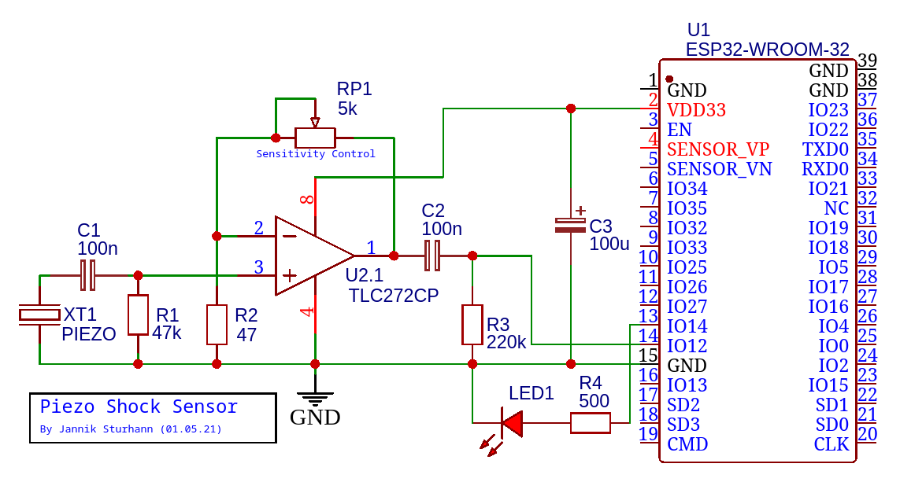
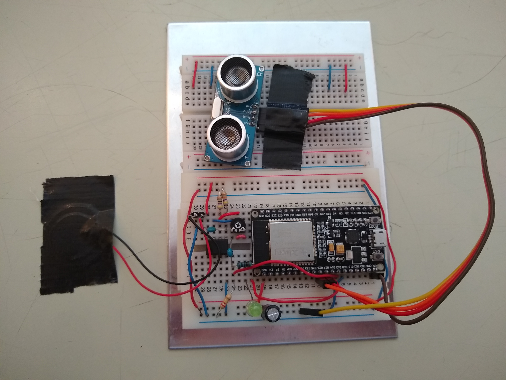

## Experiment mit Erschütterungs- und Abstandssensor auf einem ESP32 und einem MQTT Broker auf Ubuntu

In diesem Experiment wurde eine Mosquitto (MQTT) Broker auf einem Ubuntu System aufgesetzt.

Auf einem ESP32 wurde ein Erschütterungssensor, mittels Piezo Element und ein HC-SR04 Abstandssensor aufgesetzt. 
Dabei sendet der Erschütterungssensor eine Nachricht mit dem Topic "esp32/tap", wenn eine Erschütterung erkannt wurde.
Der Abstandssensor ist so konfiguriert, dass die Mikrosekunden gezählt werden, die zwischen einem emmitiertem Ultraschallimpuls und dem Empfang selbigem vergangen sind.
Es werden 10 Einzelmessungen vorgenommen, welche dann aufsteigend sortiert werden. Zuletzt wird die Differenz zwischen dem größten und dem kleinsten Messwert genommen. Ist die Differenz größer als ein definierter Threshold, wird eine Nachricht mit dem Topic "esp32/ultrasonic" und dem Differenzwert als Nachricht gesendet.
Der Abstandssensor wird somit als Bewegungssensor verwendet.




## Mosquitto Broker Installation auf Ubuntu 
```
apt-add-repository ppa:mosquitto-dev/mosquitto-ppa
apt-get update
apt-get install mosquitto
apt-get install mosquitto-clients
apt clean
```

#### Debug Subscriber, der alle Nachrichten abfängt
  - ```-h``` für host
  - ```-v``` für verbose outout
  - ```-t``` topic, dass abboniert werden soll. '#' als Wildcard für alle Topics
  - Command: ```mosquitto_sub -h localhost -v -t "#"```

#### Senden einer lokalen Testnachricht "XXX" mit dem Topic "test/pling"
  - ```-h``` für host
  - ```-t``` für topic 
  - ```-m``` für die gesendete Nachricht
- Command: ```mosquitto_pub -h localhost -t "test/pling" -m "XXX"```

## Client Setup auf dem ESP32
Als ESP32 Modul wurde ein "ESP32 Dev Kit C V4" von Az-Delivery verwendet.
Mittels der Arduino Library PubSubClient kann man komfortabel eine Verbindung zum Mosquitto Broker aufbauen. Dafür muss in der Mosquitto config, der Broker nach außen geöffnet werden.
In meinem Setup habe ich das Wlan Interface meines Laptops freigegeben, was mit hinzufügen der Zeile ```bind_interface wlp5s0``` in der Datei ```/etc/mosquitto/mosquitto.conf``` möglich war. Das aktull verwendete Interface kann mit dem Befhl ```ip a``` herausgefunden werden.
Nach dem Aktualisieren der Config muss der Service mit dem Befehl ```sudo service mosquitto restart``` neu gestartet werden.

## Fazit 
Sowohl der Erschütterungs-, sowie der Abstandssensor funktionierten gut in dem beschriebenen Setup. Die Nutzung des Abstandssensors als Bewegungssensor hat dabei auf kurze Abstände bis ca. 50cm ohne Probleme funktioniert. Bei längeren Abständen sind gelegentlich fehlerhafte Messwerte aufgetreten. Hier müsste der Schwellenwert angepasst werden 

## Referenzen
  - https://randomnerdtutorials.com/esp32-mqtt-publish-subscribe-arduino-ide/
  - https://elektro.turanis.de/html/prj121/index.html
